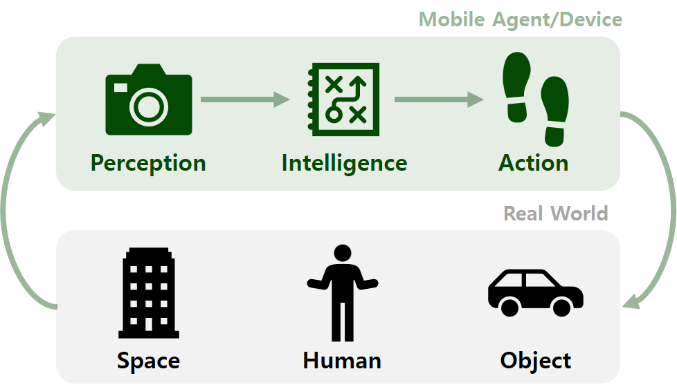

_Mobile Intelligence Laboratory_ (shortly **_MINT Lab_**) is an research group for **perception, intelligence, and actions for mobile agents and devices** such as robots, cars, drones, and also smartphones. _MINT Lab_ belongs to [Computer Science and Engineering Department](https://computer.seoultech.ac.kr/) in [Seoul National University of Science and Technology](https://en.seoultech.ac.kr/) (shortly SEOULTECH).

## Mission
_MINT Lab_ wants to apply our research results not only to academic papers but also to real-world problems. We have a definite research goal as **mobile intelligence for solving real-world problems**. We hope that our research makes our world and society better. To fulfill the mission, _MINT Lab_ and its members strive for **sharing, collaboration, and mutual growth**.

## News
* 2024/02/26 - _Dongwook Heo_ joined the lab.
* 2023/09/05 - _Nguyen Cong Quy_ joined the lab.
