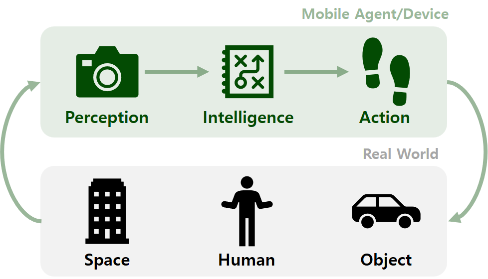

_Mobile Intelligence Laboratory_ (shortly **_MINT Lab_**) is an research group for **perception, intelligence, and actions for mobile agents and devices** such as robots, cars, drones, and also smartphones. _MINT Lab_ belongs to the [Department of Computer Science and Engineering](https://computer.seoultech.ac.kr/) in [Seoul National University of Science and Technology](https://en.seoultech.ac.kr/) (shortly SEOULTECH).

## Mission
_MINT Lab_ wants to apply our research results not only to academic papers but also to real-world problems. We have a definite research goal as **mobile intelligence for solving real-world problems**. We hope that our research makes our world and society better. To fulfill the mission, _MINT Lab_ and its members strive for **sharing, collaboration, and mutual growth**.

## News
* 2026/03/01 - _Chihyuk Min_ joined the lab as a master student.
* 2026/02/12 - *Dongwook Heo* won the Outstanding Thesis Award at his graduation ceremony.
* 2026/02/06 - *Dongwook Heo* and _Jin Won Choi_ won the Best Paper Award in KRoC 2026. [[Media Coverage]](https://www.irobotnews.com/news/articleView.html?idxno=44808)
* 2026/01/01 - _Seungpyo Jeon_, _SeoHyun Park_, _Kyoosuk Hwang_, and _Hyojun Choi_ joined the lab as undergraduate students.
* 2026/01/01 - _Mingi Choi_ joined the lab as a master student.
* 2025/07/01 - _Daewon Kim_ and _Siyeong Oh_ joined the lab as undergraduate student and collaborator.
* 2025/04/07 - _Dayena Jeong_ joined the lab as a master student.
* 2025/02/14 - _Jin Won Choi_, _Chan Ho Seo_, and _Jun Hyeok Choi_ won the Best Paper Award in [JKROS](https://jkros.org/). [[Media Coverage]](https://www.irobotnews.com/news/articleView.html?idxno=37582) [[School News]](https://seoultech.ac.kr/intro/infobox/research?do=commonview&bnum=58276&bidx=557671)

  Older news are archived [here](https://github.com/mint-lab/mint-lab.github.io/blob/master/mint-lab/home_news.md).